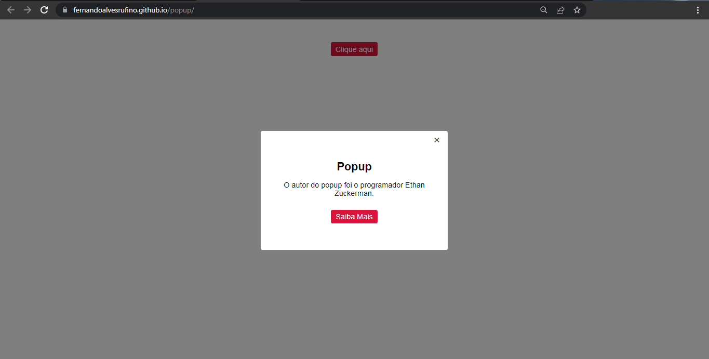

<h1 align="center"> Pop-Up </h1>

Pop-up simples de uma página web  

  <a href="#-tecnologias">Tecnologias</a>&nbsp;&nbsp;&nbsp;|&nbsp;&nbsp;&nbsp;
  <a href="#-projeto">Projeto</a>&nbsp;&nbsp;&nbsp;|&nbsp;&nbsp;&nbsp;
  <a href="#memo-licença">Licença</a>

  

 

  

## 🚀 Tecnologias

Esse projeto foi desenvolvido com as seguintes tecnologias:

- HTML e CSS
- JavaScript
- Git e Github

## 💻 Projeto

Pop-up simples para implementar em uma página web.

- [Acesse o projeto finalizado, online](https://fernandoalvesrufino.github.io/popup/)

## :memo: Licença

Esse projeto está sob a licença MIT.

---

by Fernando Rufino
